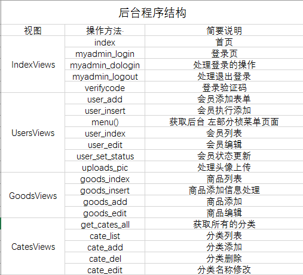
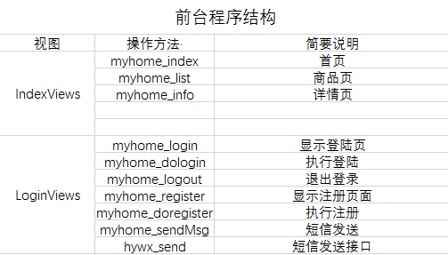

# **YUMI-Shop**

#### 项目的目录介绍

​		在需求阶段，我们将CMS 分为了前台和后台两个应用。因为是通过Django 框架进行开发，所
以只需要为每个应用单独声明一个url路由，分别命名为myhome_index(前台入口)和myadmin_login(后台应用
入口)，并分别存放到项目目录myhome和myadmin（该目存放在Web 服务器的根目录下）下面。。分别访问两个入口文件Django 自动生成项目结构目录，如下所示：

####项目目录结构

web
├── manage.py
├── myadmin
│   ├── admin.py
│   ├── apps.py
│   ├── __init__.py
│   ├── migrations
│   ├── models.py
│   ├── tests.py
│   ├── urls.py
│   └── views.py
├── myhome
│   ├── admin.py
│   ├── apps.py
│   ├── __init__.py
│   ├── migrations
│   ├── models.py
│   ├── tests.py
│   ├── urls.py
│   └── views.py
├── static			
├── templates			
└── web
    ├── __init__.py
    ├── settings.py
    ├── urls.py
    └── wsgi.py

#### 模块架构

**前台应用模块**

|     模块     |                             操作                             |     权限     |
| :----------: | :----------------------------------------------------------: | :----------: |
|     首页     |                获取首页全部内容、获取公告内容                |      无      |
|   商品列表   |         获取某一个商品分类的全部信息（一到三级列表）         |      无      |
|     搜索     |                          搜索和显示                          |      无      |
| 登录注册管理 |        获取注册界面、添加、登录处理、退出、检查唯一性        |      无      |
|   个人中心   | 显示个人空间首页平台、用户信息修改、头像设置、设置收藏、取消收藏、账号安全：密码修改、手机号修改、密保问题（*）、支付密码 | 登录-------- |
|    购物车    |                          添加、删除                          |              |

（后期可补充）

**后台应用模块**

|     模块      |                           操作                            |     权限     |
| :-----------: | :-------------------------------------------------------: | :----------: |
|   登录管理    |       获取登录页面、处理登录、退出、获取验证码操作        |      无      |
| 操作界面管理* |             主页、顶部、菜单、操作区域、底部              | 后台用户登录 |
|   会员管理*   | 会员列表、会员添加、会员信息的修改、会员状态（正常/禁用） | 管理用户权限 |
| 商品分类管理* |              商品分类列表、商品分类添加/修改              | 管理用户权限 |
|   商品管理*   |            商品列表、商品添加、商品信息的修改             | 管理用户权限 |
|   订单管理    |         订单列表、订单添加、订单取消、订单的修改          | 管理用户权限 |

注释：* 表示已完成

#### 程序视图结构（目前进度）

#### 数据库表

myadmin_cates

| 字段名 | 字段类型 | 默认值 | 长度 | 描述                       |
| ------ | -------- | ------ | ---- | -------------------------- |
| id     | int      |        | 11   | 主键，自增                 |
| name   | varchar  |        | 20   | 分类名                     |
| pid    | int      |        | 11   | 分类id                     |
| path   | varchar  |        | 50   | 分类所属父级，顶级分类为 0 |

myadmin_goods

| 字段名    | 字段类型 | 非空     | 默认值 | 长度 | 描述                    |
| --------- | -------- | -------- | ------ | ---- | ----------------------- |
| id        | int      | not null |        | 11   | 主键，自增              |
| goodsname | varchar  | not null |        | 50   | 商品名称                |
| title     | varchar  | not null |        | 255  | 标题                    |
| price     | double   | not null |        | 0    | 价钱 如：100.0          |
| goodsnum  | int      | not null |        | 11   | 商品库存数量            |
| pic_url   | varchar  | not null |        | 255  | 商品图片存储路径        |
| goodsinfo | longtext | not null |        | 0    | 商品详情简介            |
| ordernum  | int      | not null |        | 11   | 订购数量                |
| clicknum  | int      | not null |        | 11   | 点击热度、点击数量      |
| status    | int      | not null |        | 11   | 0新品 1热卖 2推荐 3下架 |
| addtime   | datetime | not null |        | 6    | 商品添加时间            |
| cateid_id | int      | not null |        | 11   | 对应myadmin_cates表的id |
| brand     | varchar  | not null |        | 50   | 品牌名                  |
| color     | varchar  | not null |        | 50   | 商品颜色                |
| sizes     | varchar  | not null |        | 50   | 商品尺码                |

myadmin_users

| 字段名   | 字段类型 | 非空     | 默认值 | 长度 | 描述                 |
| -------- | -------- | -------- | ------ | ---- | -------------------- |
| id       | int      | not null |        | 11   | 主键，自增           |
| nikename | varchar  |          |        | 20   | 会员昵称             |
| password | varchar  | not null |        | 80   | 存储的是加密后的密码 |
| phone    | varchar  | not null |        | 11   | 手机号               |
| email    | varchar  | not null |        | 100  | 邮箱                 |
| age      | int      |          |        | 11   | 年龄                 |
| pic_url  | varchar  | not null |        | 100  | 头像存储路径         |
| sex      | varchar  |          |        | 1    | 1:男  0:女           |
| status   | int      | not null |        | 11   | 0 正常 1 禁用 2 删除 |
| addtime  | datetime | not null |        | 6    | 会员信息添加时间     |

myadmin_cart

| 字段名     | 字段类型 | 非空     | 默认值 | 长度 | 描述       |
| ---------- | -------- | -------- | ------ | ---- | ---------- |
| id         | int      | not null |        | 11   | 主键，自增 |
| color      | varchar  | not null |        | 20   | 商品颜色   |
| sizes      | varchar  | not null |        | 20   | 商品尺码   |
| num        | int      | not null |        | 11   | 购买数量   |
| lengths    | int      | not null |        | 11   |            |
| goodsid_id | int      | not null |        | 11   | 商品id     |
| uid_id     | int      | not null |        | 11   | 用户id     |

myadmin_orders   

| 字段名     | 字段类型 | 非空     | 默认值 | 长度 | 描述                     |
| ---------- | -------- | -------- | ------ | ---- | ------------------------ |
| id         | int      | not null |        | 11   | 主键，自增               |
| uid_id     | int      | not null |        | 11   | 会员Ius                  |
| username   | varchar  | not null |        | 20   | 会员名                   |
| address    | varchar  | not null |        | 255  | 收获地址                 |
| phone      | varchar  | not null |        | 11   | 手机号码                 |
| totalprice | double   | not null |        | 0    | 总价格                   |
| paytype    | int      | not null |        | 11   | 支付方式                 |
| addtime    | datatime | not null |        | 6    | 下单时间                 |
| paytime    | datatime | not null |        | 6    | 支付时间                 |
| status     | int      | not null |        | 11   | 0:未支付  1:已支付   ... |

myadmin_orderinfo

| 字段名     | 字段类型 | 非空     | 默认值 | 长度 | 描述       |
| ---------- | -------- | -------- | ------ | ---- | ---------- |
| id         | int      | not null |        | 11   | 主键，自增 |
| num        | int      | not null |        | 11   | 商品数量   |
| goodsid_id | int      | not null |        | 11   | 商品id     |
| order_id   | int      | not null |        | 11   | 订单id     |
| price      | double   | not null |        | 0    | 下单时价格 |

myadmin_address

| 字段名  | 字段类型 | 非空     | 默认值 | 长度 | 描述                       |
| ------- | -------- | -------- | ------ | ---- | -------------------------- |
| id      | int      | not null |        | 11   | 主键，自增                 |
| uid     | int      | not null |        | 11   | 登陆的用户id               |
| name    | varchar  | not null |        | 20   | 收货人名字                 |
| address | varchar  | not null |        | 255  | 收货地址                   |
| phone   | varchar  | not null |        | 11   | 收获手机号                 |
| status  | int      | not null |        | 11   | 0：默认地址  1：非默认地址 |

myadmin_collect

| 字段名 | 字段类型 | 非空     | 默认值 | 长度 | 描述       |
| ------ | -------- | -------- | ------ | ---- | ---------- |
| id     | int      | not null |        | 11   | 主键，自增 |
| uid    | int      | not null |        | 11   | 用户id     |
| sid    | int      | not null |        | 11   | 商品id     |

